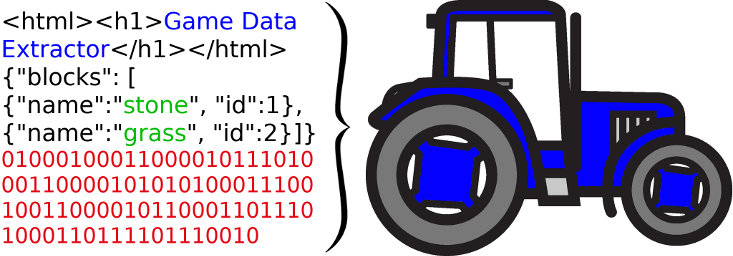

# DataTractor


Extract game data from web sources.

## How to use

You need python version 3.
In the repo's main directory, simply run the `xtract` script:

```bash
python xtract.py -v <game_version> -o <output_directory>
```

`-o` might be omitted, in which case `<current_dir>/out/generated_<game_version>` is used.

Example:

```bash
python xtract.py -v 1.12.2
```

At the moment, only the packet data is extracted.
